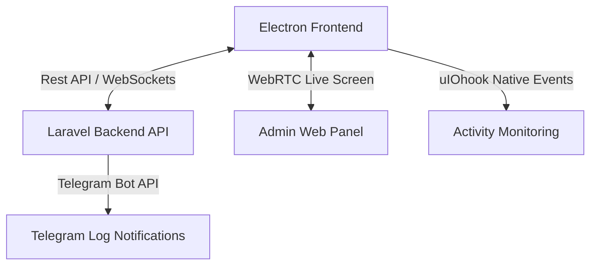

# 📊 WND Tracker & Employee Management System - Detailed Documentation

Welcome to the comprehensive documentation of the **WND Tracker & Employee Management System**. This document explains the architecture, features, and internal workings of the project, including how the frontend and backend communicate and how key systems are implemented.

---

## 🏛️ System Architecture Overview

The system uses a **decoupled architecture** split into three main parts:
1. **Headless Backend (Laravel API Engine)**: Manages secure API endpoints, MySQL database via Eloquent ORM, background jobs, settings, and integrations (e.g., Telegram Bot API).
2. **Frontend client (React + Vite + Electron)**:
   - Run as a **Web app** in a browser (for timesheet reviews, chat, scheduling).
   - Run as a **Desktop app** in Electron (for active time-tracking, native screenshot capturing, and keyboard/mouse activity hooks).
3. **Database (MySQL)**: Standard relational schema.

---

## 🎯 Key Core Modules & Features

### 1. Authentication & Security (2FA)
- **Traditional Auth**: Laravel Sanctum cookie-based and token-based stateful authentication.
- **Two-Factor Authentication (2FA)**:
  - Enforced for administrative routes (`AdminTwoFactorMiddleware`) like viewing employee timesheets, screenshots, and triggering live monitoring.
  - Supports standard **OTP via email/SMS**, **TOTP (Google Authenticator / Microsoft Authenticator)** using QR codes, and **Backup Recovery Codes**.
  - Setup flow: User requests setup -> Backend generates secret/QR -> User verifies code -> 2FA activated. Backup codes are generated for account recovery.

### 2. Time Tracking Engine (Desktop & Web)
- **Local Tracker State**: Handled via a global tracker core in the frontend (`window.__tt_core`). It maintains tracking state, intervals, and active media streams even if the user navigates between react pages.
- **Start / Stop Logs**:
  - On start: The user can provide a note or fallback to the task title. A Telegram notification is dispatched to administrators.
  - On pause/stop: The tracker calculates duration and uploads the log.
- **Offline / Batch Support**: The desktop app can cache tracking details and sync them using the `/desktop/batch` endpoint.

### 3. Native User Activity Monitoring
- **OS-Level Keyboard & Mouse Hooks**:
  - In **Electron mode**, the app imports `uiohook-napi` to listen to global OS events (mouse clicks, keypresses, mouse scrolling) even when the tracker is minimized or in the background.
  - A high-frequency **Cursor Poller** polls the cursor position every 100ms (`screen.getCursorScreenPoint()`) to bypass limitations on touchscreens and record screen pointer movements.
- **Web Browser Fallback**: If run in standard browsers, it attaches DOM listeners to track mouse moves, clicks, keyboard events, and scroll gestures within the browser page.
- **Activity Logs**: Activities are compiled into minute-by-minute stats (`keyboard_clicks`, `mouse_clicks`, `mouse_scrolls`, `mouse_movements`) and uploaded to the database linked to the user's current timesheet.

### 4. Smart Random Screenshot Engine
- **WebRTC Screen Sharing API**:
  - The renderer requests display capture using `navigator.mediaDevices.getUserMedia` or `getDisplayMedia`.
  - Electron main process intercepts this request via `setDisplayMediaRequestHandler` and automatically selects the primary screen, bypassing the browser permission prompt for a seamless UX.
- **Capture Logic**:
  - **Randomized schedule**: Calculates random intervals (e.g., 3 random shots per 10 minutes) to prevent users from predicting captures.
  - Generates a frame canvas -> converts it to a compact `.webp` blob -> uploads it via `timeTrackingAPI.uploadScreenshot` to the backend.
  - Features a **Resume Screen Sharing** popup warning if screen sharing is accidentally stopped or permission is denied.

### 5. WebRTC Live Screen Streaming
- **Real-Time Administration View**: Allows administrators to visually check what an employee is working on in real-time.
- **Signaling Handshake**:
  1. Admin clicks **Live View** on the Team Availability dashboard.
  2. Frontend sends request `/users/{user}/trigger-live` to Laravel.
  3. Laravel broadcasts an event or sets a signal in the `signals` table.
  4. The employee's client polls or listens to this signal, opens the local screen media stream, creates an `RTCPeerConnection`, and generates a WebRTC Offer.
  5. The Offer is uploaded to `/users/{user}/signal`.
  6. Admin client retrieves the Offer, replies with a WebRTC Answer, and the direct peer-to-peer screen stream begins instantly with high framerate and zero lag.
  7. When closed, a call to `/users/{user}/stop-live` terminates the PeerConnection and stops media tracks.

### 6. Interactive Chat & Messaging System
- **Real-Time Conversations**: Supports 1-to-1 direct messaging and multi-member group chat rooms.
- **Features**:
  - Message history persistence in MySQL (`messages` table).
  - Real-time typing indicators.
  - Read receipts (`message_reads` table).
  - Ability to clear logs or add/remove members from conversations dynamically.

### 7. Voice Rooms & WebRTC Meetings
- **Voice Channels**: High-performance voice rooms using WebRTC peer-to-peer connections (`voiceStore.ts`).
- **Meetings**: Fully-fledged virtual conference rooms (`MeetingRoom.tsx`) that support:
  - Video streams (camera feeds).
  - Audio streams (microphone audio).
  - Desktop Screen sharing during meetings.
  - Multi-party signaling using WebSockets and Laravel endpoints. Includes automatic ICE connection recovery and renegotiation logic for unstable connections.

### 8. Telegram Bot Notifications
- **Independent Channels**: Dispatches alerts for tracking events without relying on local mail servers.
- **Fallback Admin Lookups**: If the default administrator Telegram chat ID (`TELEGRAM_CHAT_ID` in `.env`) is not defined, `TelegramService` queries the database for active Admin/Project Manager users with a configured `telegram_chat_id` and dispatches alerts directly to their Telegram accounts.
- **Alert Types**:
  - **Tracker Starts**: Emitting details like "Employee Name", "Starting time", "Project Name", and "Active Task".
  - **Tracker Resumed / Paused / Stopped**: Emitting session duration details and start/end work log descriptions.

---

## 📂 Database Schema Overview

Here are the key database models and their purpose:

| Model | Table | Description |
|---|---|---|
| **User** | `users` | Credentials, role (admin, project_manager, employee), 2FA secret, and Telegram ID. |
| **Client** | `clients` | Standard client profiles. |
| **Project** | `projects` | Projects mapped to clients, managed by managers, and assigned to users. |
| **Task** | `tasks` | Tasks with status, priority, description, and Kanban board order. |
| **TimeLog** | `time_logs` | Timesheet sessions (start time, end time, duration, start & end work log note). |
| **ActivityLog**| `activity_logs` | Compiled keyboard/mouse input stats per minute. |
| **Screenshot** | `screenshots` | File links to captured screen images with time breakdowns. |
| **Setting** | `settings` | Dynamic app-wide configuration key-value storage. |
| **Conversation**| `conversations` | Chat rooms / direct messages records. |
| **Meeting** | `meetings` | Scheduled and active group video/audio meeting rooms. |
| **Signal** | `signals` | WebRTC SDP & ICE candidates storage for peer handshakes. |

---

## 🛠️ Codebase Structure

### Frontend (`/frontend`)
- **`electron/main.cjs`**: Electron lifecycle, window creation, background global `uiohook` inputs listener, display stream auto-capture setup.
- **`src/pages`**: React components matching URLs (e.g. `TimeTracking.tsx`, `Timesheets.tsx`, `Chat.tsx`, `MeetingRoom.tsx`).
- **`src/hooks/useGlobalTrackerActivity.ts`**: Unified user activity tracker hook.
- **`src/stores`**: State managers (Zustand/Query) for WebRTC meetings (`meetingStore.ts`), voice calls (`voiceStore.ts`), and chat.

### Backend (`/employee-management-system`)
- **`app/Http/Controllers`**: Handle client API logic (CRUD, user settings, time log triggers, etc.).
- **`app/Services/TelegramService.php`**: Formats and triggers Telegram notifications using curl requests.
- **`app/Services/NotificationService.php`**: Handles routing notifications to dynamic preferences (Telegram, Email, In-app).
- **`routes/api.php`**: Standard HTTP endpoints (public vs authenticated, standard vs Admin-2FA).
